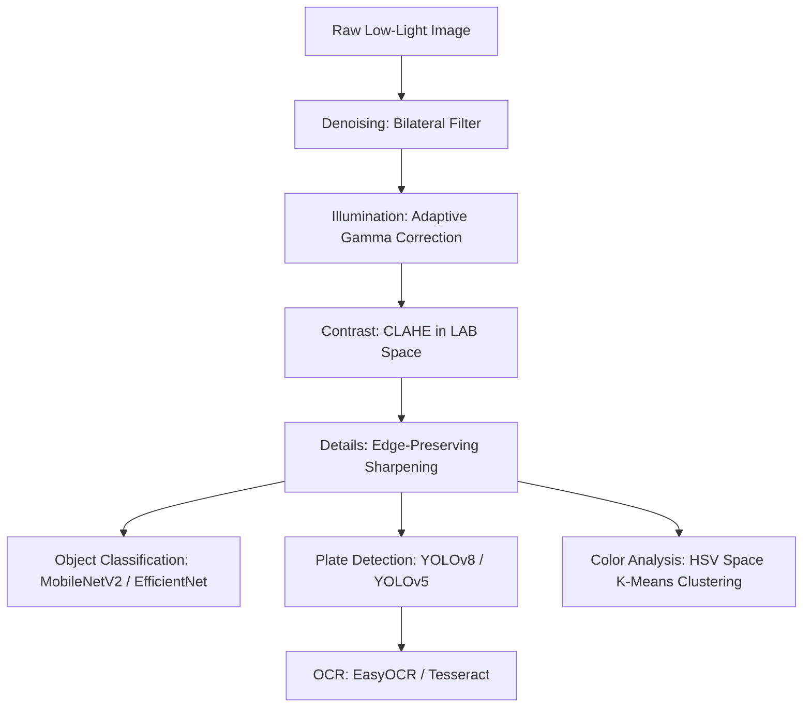

# 🌙 Automated Low-Light Car Image Enhancer

A premium computer vision pipeline that automatically enhances low-light car images, detects vehicles and their license plates, recognizes plate text, classifies car colors, and extracts geometric contour features.

---

## 🚀 Pipeline Architecture

The system processes images through a sequential, state-of-the-art computer vision pipeline:



---

## 🛠️ Core Features & Algorithmic Details

### 1. Adaptive Low-Light Enhancement
* **Bilateral Filtering (Denoising):** Estimates the local noise level using the Laplacian of the grayscale image ($L = \nabla^2 I$). If noise standard deviation $\sigma_{noise} > 20$, it applies a bilateral filter to smooth regions while preserving crisp boundaries:
  $$I_{denoised}(\mathbf{x}) = \frac{1}{W_p} \sum_{\mathbf{x}_i \in \Omega} I(\mathbf{x}_i) g_r(\|I(\mathbf{x}_i) - I(\mathbf{x})\|) g_s(\|\mathbf{x}_i - \mathbf{x}\|)$$
* **Adaptive Gamma Correction:** Evaluates local image luminance to apply adaptive power-law transformation:
  $$I_{corrected} = 255 \times \left(\frac{I_{denoised}}{255}\right)^{\frac{1}{\gamma}}$$
  Where $\gamma = 2.0$ for dark regions, $\gamma = 0.8$ for bright spots, and $\gamma = 1.2$ otherwise.
* **CLAHE in LAB Space:** Converts BGR to LAB color space, applies Contrast Limited Adaptive Histogram Equalization on the $L$ (luminance) channel to avoid color distortion, then converts back to BGR.
* **Edge-Preserving Sharpening:** Applies Gaussian smoothing and performs weighted blending to enhance image detail:
  $$I_{sharp} = \alpha I_{clahe} + \beta (I_{clahe} * G_{\sigma}) + \gamma$$

### 2. Vehicle & License Plate Detection
* **Object Classification:** Integrates pre-trained **MobileNetV2** and **EfficientNetB0** models to identify vehicle model types and verify the presence of vehicles in the input frame.
* **Localization & Detection:** Leverages **YOLOv8** and **YOLOv5** models to output bounding boxes around cars and license plates in low-illumination environments.

### 3. OCR (Optical Character Recognition)
* Utilizes **EasyOCR** and **PyTesseract** engines on cropped license plate regions to extract text. Pre-processing includes bilateral filtering and adaptive Canny edge detection to isolate characters from background noise.

### 4. Vehicle Color Recognition
* Conversions to **HSV (Hue, Saturation, Value)** color space.
* Employs **K-Means Clustering** ($K=5$) to segment the car body pixels from tires and the environment, identifying the dominant vehicle body color.

---

## 📦 Dependencies & Setup

Ensure you have Python 3.8+ installed along with the following libraries:

```bash
pip install opencv-python numpy matplotlib scikit-image tensorflow torch easyocr pytesseract tqdm
```

For Tesseract OCR engine installation on Ubuntu/Debian:
```bash
sudo apt-get install tesseract-ocr
```

---

## 💻 Code Usage

Run the main execution pipeline:

```python
from image_processing_assignment_1 import image_processing_pipeline, detect_car_and_license_plate

# Load low-light image
image = cv2.imread("low_light_car.jpg")

# Run enhancement pipeline
enhanced_img = image_processing_pipeline(image)

# Perform vehicle/plate detection and character extraction
license_texts = detect_car_and_license_plate(enhanced_img)
print(f"Extraction Results: {license_texts}")
```

---

## 📈 Quality Metrics
The performance of the image enhancement stage is measured quantitatively against ground truth frames using two metrics:
1. **PSNR (Peak Signal-to-Noise Ratio):** Measures the reconstruction quality of the denoised image.
2. **SSIM (Structural Similarity Index Measure):** Assesses visual degradation and luminance/contrast consistency.
